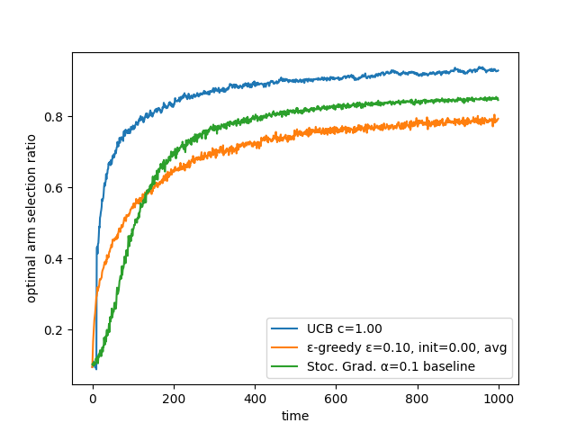

# rl-bandit: A rust bandit implementation

Simple multi-armed bandit algorithm implementation.

Implements several bandit algorithms (most of them found in ``Reinforcement Learning: An Introduction'' by *Richard S. Sutton* and *Andrew G. Barto*. It is available for free at http://www.incompleteideas.net/book/the-book-2nd.html).



# Usage example

Initialize the bandit algorithm (a few examples)

```rust
// ε-greedy algorithm with 10 arms, ε=0.1, initial values of 0
let egreedy1 = EGreedy::new(10, 0.1, 0.0, UpdateType::Average));

// same ε-greedy but non-stationary with step size of 0.1
let egreedy2 = EGreedy::new(10, 0.1, 0.0, UpdateType::Nonstationary(0.1));

// Upper Confidence Bound with 10 arms and c=1
let ucb1 = UCB::new(10, 1.);

// Stochastic gradient with 10 arms, step size of 0.1, with baseline
let sg1 = StochasticGradient::new(10, 0.1, true);
```


feedback loop:
```rust
// choose the best action according to the bandit algorithm
let action = ucb1.choose();

let reward = [...]; // using the action and computing the reward

// updates the bandit algorithm using the reward
ucb1.update(action, reward);
```


**Note:** A more detailed example and benchmark can be found in the [rl-bandit-bench](https://gitlab.com/librallu/rl-bandit-bench) crate.


# implemented algorithms:

- [X] ε-greedy
- [X] optimistic ε-greedy
- [X] Upper-Confidence-Bound (UCB)
- [X] Stochastic Gradient Ascent
- [ ] EXP3

# library contents

 - **bandit.rs** traits required to implement a bandit algorithm and helper functions
 - **src/bandits:** contains implemented bandit algorithms


